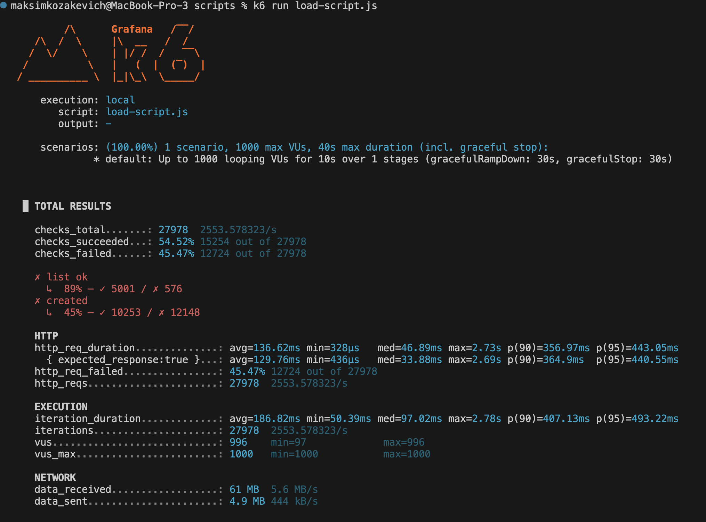
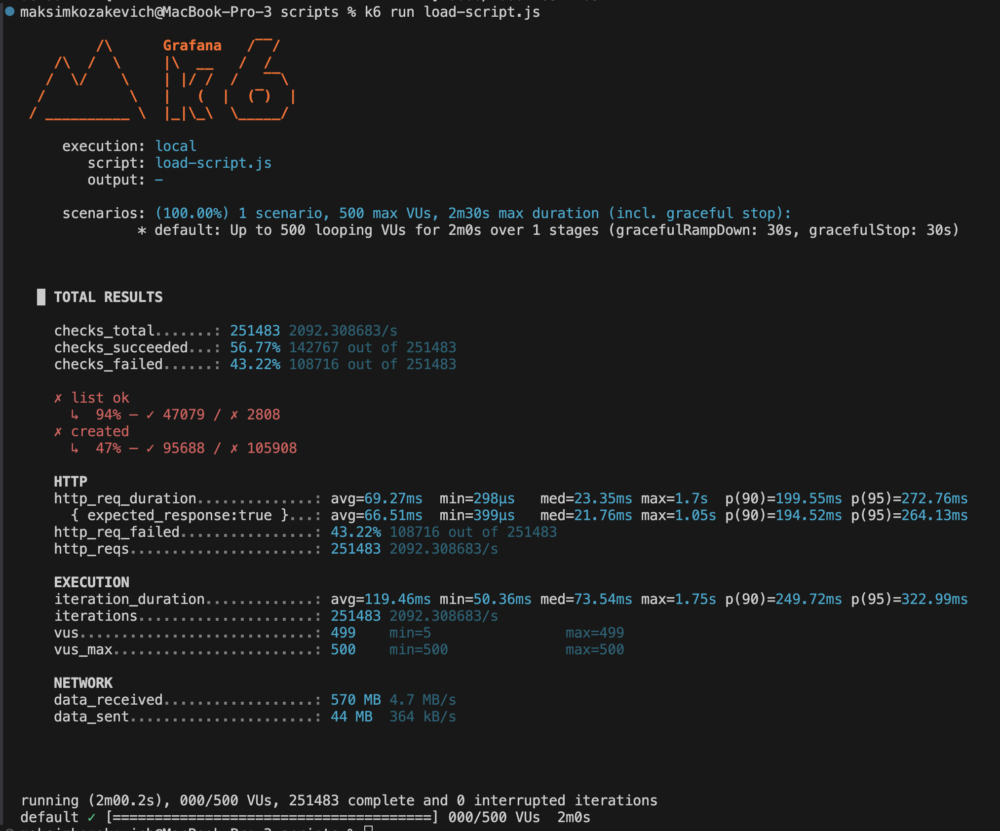
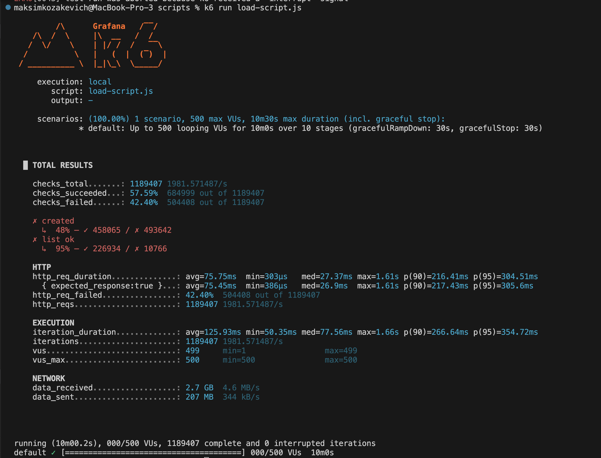

# ДЗ 1

## 1. Метрики

Какие метрики будем смотреть в первую очереднь:

1. Метрики базы (число активных коннектов, affected rows и т.д.)
2. Query latency p95
3. Использование CPU

Цель - проверить, насколько хорошо выдерживают нагрузки бэк и база, и при каких нагрузках начинают падать

## 2. Запуск k6

"Пострелял" по различным сценариям при помощи k6:

1. Сценарий "Шторм" - резкий пик нагрузки (1000 пользователей за 10s)

```
{ duration: '10s', target: 1000 }
```


2. Сценарий "Волна" - плавное нарастание (0 к 500 пользователей за 2 минуты)

```
{ duration: '2m', target: 500 }
```



3. Свой сценарий. "Creep Load" - линейный рост, старт со 50 VU и +50 VU ежеминутно. "Стреляем" в течение 10 минут

```
  stages: [
    { duration: '1m', target: 50 },
    { duration: '1m', target: 100 },
    { duration: '1m', target: 150 },
    { duration: '1m', target: 200 },
    { duration: '1m', target: 250 },
    { duration: '1m', target: 300 },
    { duration: '1m', target: 350 },
    { duration: '1m', target: 400 },
    { duration: '1m', target: 450 },
    { duration: '1m', target: 500 },
  ],
```



## 3. Анализ

Сценарии, предложенные в ДЗ ("Шторм" / "Волна") приложение выдержало нормально. 1000 VU это примерно 20000 RPS, так что можно сказать, что приложение выдерживает нагрузку в 20000 RPS. Однако стоит заметить, что я запускал это на личном комьютере, где Докеру предоставлено 8 ядер, и при этом ресурс съедался почти целиком. Если говорить о реальном использовании, то всё будет зависеть от того, какие какие квоты будут выставлены, так что 20k RPS может и не выдержать.

"Creep Load" (она же "Медленная смерть") юзал чтобы попробовать забить пул коннектов к базе. Это получилось сделать - примерно спустя 6 минут, на 300 пользователях (то есть примерно 60% нагрузки) число активных коннектов достигло 100. Latency, который до этого рос медленно, начал расти скачкообразно. Посмотрел в логи контейнера с базой - стали появляться сообщения "FATAL:  sorry, too many clients already".

Итого: CPU выдерживает. Жесткий предел системы примерно 300 конкурентных пользователей. Основным боттлнеком является пул коннектов к базе (максимум около 100).
