# ДЗ 2

## Ответы на вопросы с шага 3:

### Основные характеристики топика

Ниже приведена информация о метриках с борда топика в UI:

1. Partitions

- Обеспечивает параллелизм чтения и записи
- Позволяет масштабировать нагрузку
- Определяет максимальное число консьюмеров в одной consumer group, которые могут читать топик одновременно

2. Replication factor

- Обеспечивает отказоустойчивость
- Каждая партиция хранится на нескольких брокерах
- При падении брокера данные остаются доступными

3. Segment size

- Позволяет контролировать нагрузку на сеть и диск
- Позволяет оптимизировать производительность и хранение

4. Clean Up Policy

delete — удаление старых сообщений по retention
compact — хранение только последнего сообщения для каждого ключа

5. In Sync Replicas

- Определяет реплики, полностью синхронизированные с лидером
- Влияет на надёжность записи
- Гарантирует, что данные не потеряются при сбое.

### Почему здесь столько партиций? А что если их не будет? Насколько отказоустойчив топик?

Партиций несколько, чтобы обеспечить параллелизм и баланс нагрузки. Почему их именно восемь - предположу что это число взято "с запасом" под рост нагрузки, чтобы обеспечить масштабируемость.

Если партиций не будет, то:
1. Не будет параллелизма - только один консьюмер сможет читать данные.
2. Невозможно будет масштабировать и балансировать нагрузку

Replication factor здесь равен 3, то есть каждая партиция хранится на 3 разных брокерах. Предположу, что благодаря этому топик довольно отказоустойчив

## Шаг 4. НТ

Скрин терминала:

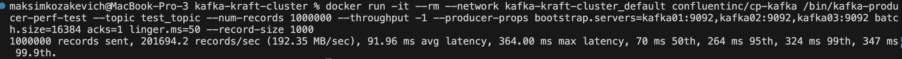

Скрин Kafka UI:

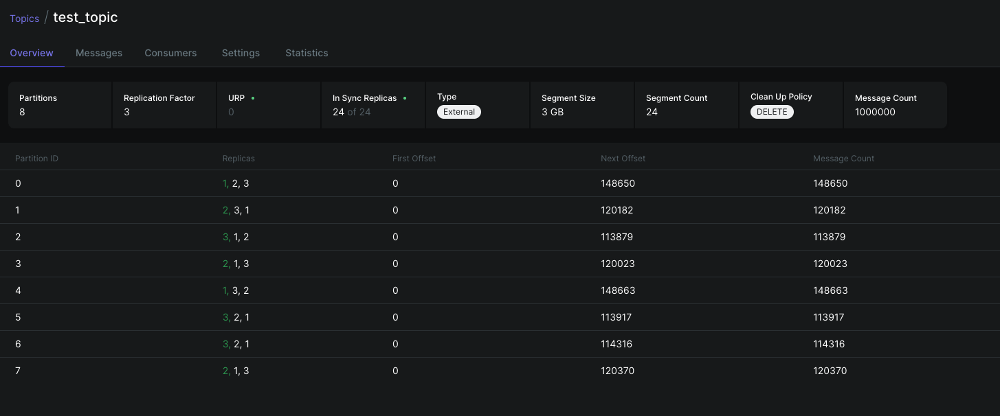

RPS == 201694.2
Average Latency == 91.96 ms
Max Latency == 364 ms
Latency по p95 == 264 ms
Latency по p99 == 324 ms

События есть на всех брокерах

## Шаг 5. Отказоустойчивость

1. Запустил скрипт, события летят

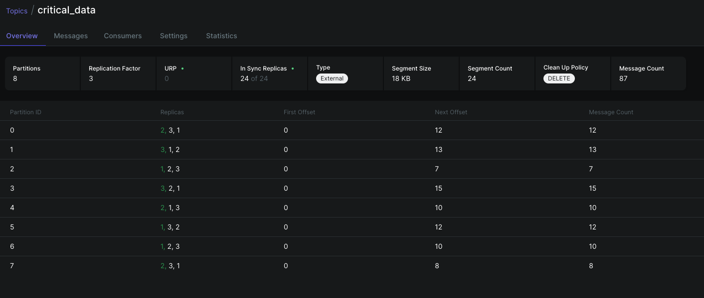

2. Остановил брокер, являющийся контроллером (№ 1)

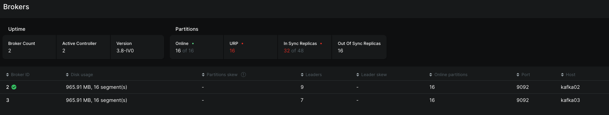

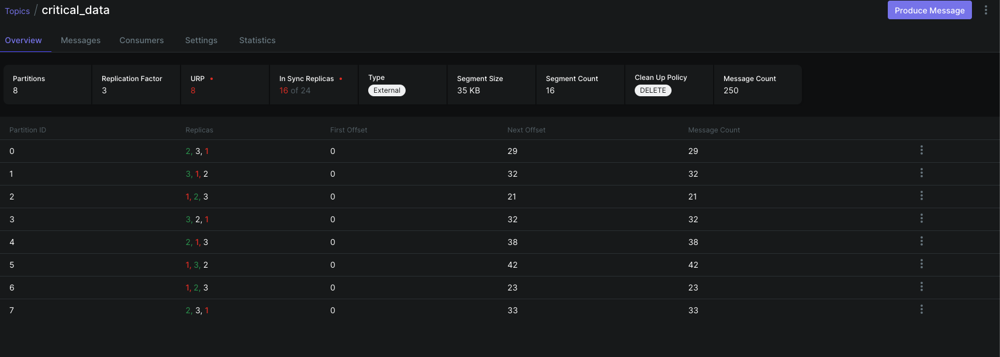

3. Остановил следующий брокер, являющийся контроллером

Судя по логам в терминале, в котором запущен скрипт, сообщения перестали доходить
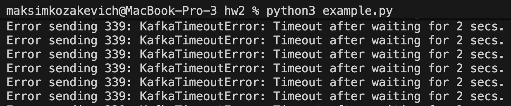

Логи контейнера последнего живого брокера. Он пытается законнектиться с двумя другими брокерами
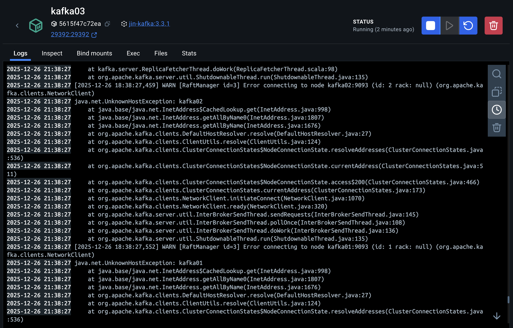

Кластер лежит, страница с топиками в UI даже не открывается

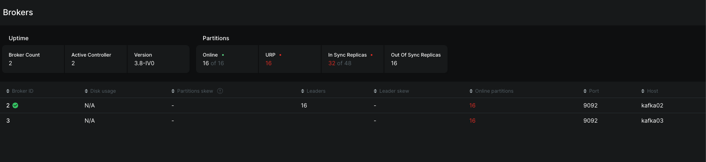

ISR (In-Sync Replicas) - это множество реплик партиции Kafka, которые полностью синхронизированы с лидером и считаются надёжными для выбора нового лидера и подтверждения записи.

Причина - второй отключенный брокер являлся контроллером, а оставшаяся реплика не входит в ISR. Поэтому новый контроллер не может быть выбран и ничего не работает

4. Восттановил один из контейнеров

Программа продолжила выполняться, ошибка исчезла

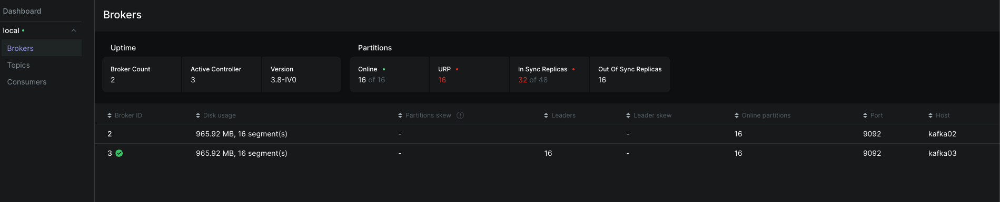

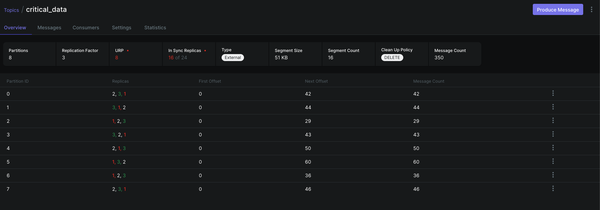

5. Восстановил контейнер

Кластер жив, данные консистентны

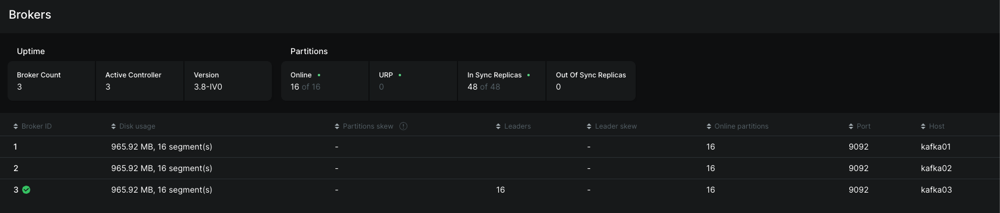

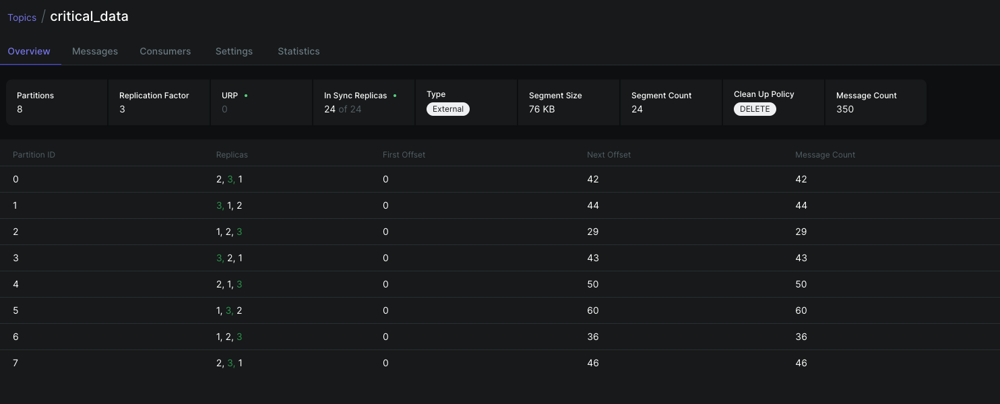
