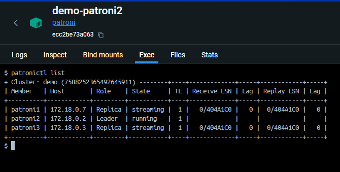
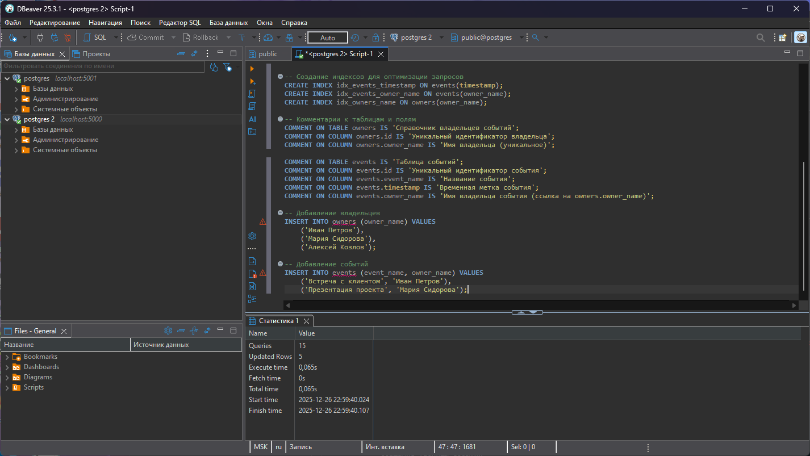
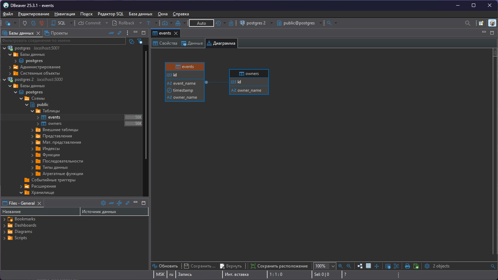
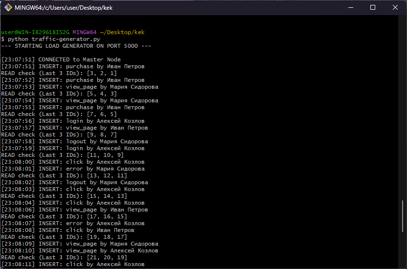
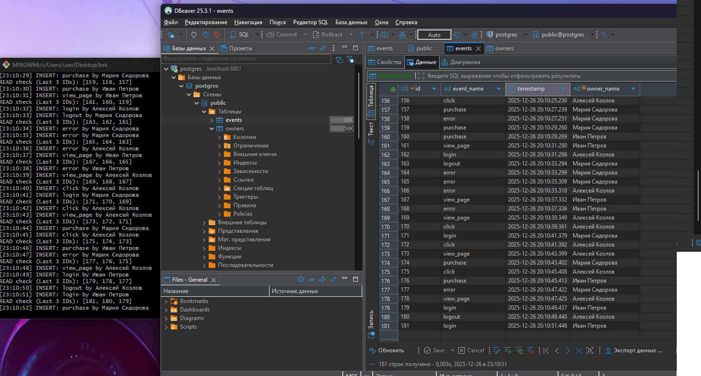

# ДЗ 3

1. Поднял кластер, в одном из контейнеров patroni выполнил команду
```
patronictl list
```


2. Открыть UI почему-то не вышло, по 7001 порту ничего не открывается. Не смог разобраться

3. Подключился к мастер ноде (у меня это порт 5000) и к реплике (5001) через DBeaver. Пролил скрипт мастер ноде





4. Запустил скрипт



Пишу в мастер ноду (порт 5000). Пишется в таблицу events. Реплика читает, в её таблице также появляются значения


